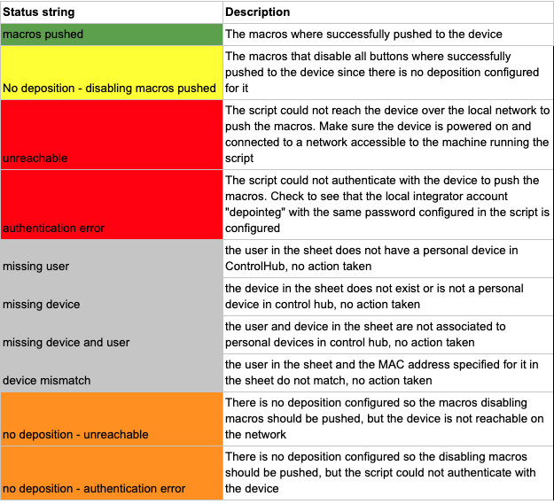
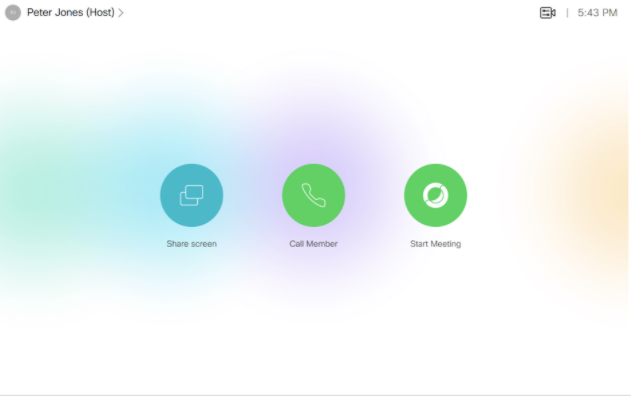
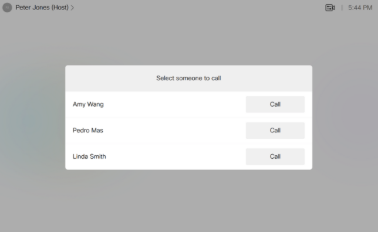
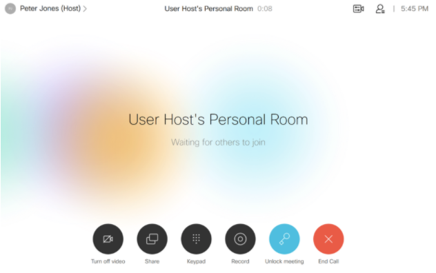
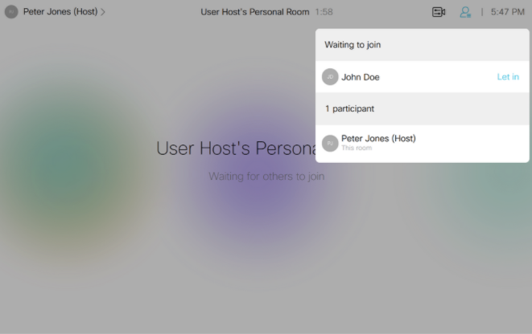
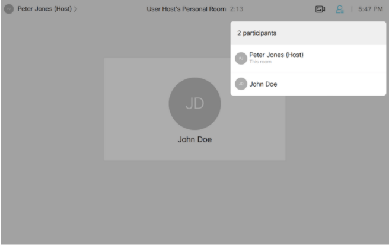
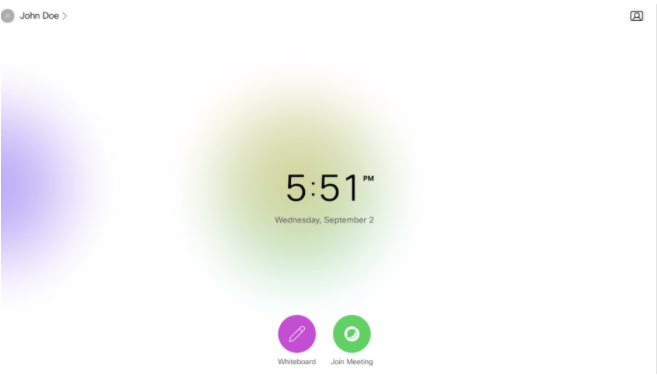
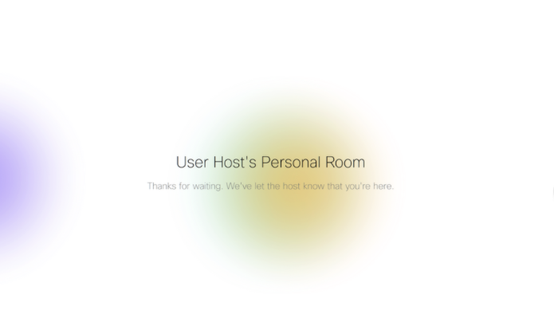

# Webex Devices Deposition Team Configurator
Python script to distribute macros to Webex Collaboration Devices such as DX80s configured in Personal Mode to limit 
their functionalty to attending a meeting in the Webex Personal Meeting Room (PMR) of the team lead or host 
and allowing the host to initiate and control the meeting or call other members of the team.  Teams are defined in Google 
Sheet generated by the script to allow admins to edit it and just assign names and roles to existing devices assigned to generic 
 users in an Webex Organization.


## Contacts
* Gerardo Chaves (gchaves@cisco.com)

## Solution Components
* Webex Collaboration Devices
* Google Sheets
* Cisco Webex Endpoint API - xAPI

## Installation/Configuration

1) Download or clone all files from this repository into the local directory of the machine from where you will execute the code  
2) Verify you have Python 3 and pip installed on the machine that will run the script. You need at least to have Python version 3.6. There are plenty of guides  
available to help you install Python 3 if needed and you can also visit the official download location at:  
https://www.python.org/downloads/  
3) Once you have Python installed. You need to install the dependencies needed for the scripts. You can use the following command:  
```pip install -r requirements.txt```  
4) Setup a Google Sheet following the example you can find here:  
https://docs.google.com/spreadsheets/d/1P-pP4O0fguGcDO3x7GB0o89mzIT8uRn8jfo2NTzMD2k/edit?usp=sharing  
It is best you make a copy into your own Google account since the names of the sheets (DATA and Legend) are important 
to keep and also the text/color of the cells in the Legends sheet are used to report status when processing on the DATA 
sheet.  
To get started, you can delete all rows of the DATA sheet except row 1 which contains the headers. The text in the header is not  
relevant to the python script but it helps you understand what your are configuring and the code assumes the actual data will start  
on the second row.  
The script will fill out the device details from the Webex Organization to which you have admin  
privileges to get you started and then you can edit it to define the various teams for the devices you want to configure.  
You can name the Sheet whatever you want as long as you configure that name as instructed in Step 5 below.  
5) This sample code uses the **pygsheets** Python library to access and edit the Google Sheet specified in step 4:   
https://github.com/nithinmurali/pygsheets  
As you can see in the instructions in that GitHub repository, you need to obtain OAuth2 credentials from Google Developers Console for 
google spreadsheet api and drive api and save the file as **client_secret.json** in same directory where you are installing this script.  
You can find step-by-step instructions here:  
https://pygsheets.readthedocs.io/en/latest/authorization.html  
6) Setup the neccessary configuration variables in **config.py**:  
**SPREADSHEET_NAME**  
Name of the Google Sheets spreadsheet you created in step 1 to 
use with this sample application. (example: "DevicesDepositionsMapping")  
**WEBEX_SITE**  
Webex site where all the host users have their Personal Meeting Rooms (example: "acme.webex.com")   
7) The code also requires that you set the following environment variables:  
**WEBEX_TEAMS_ACCESS_TOKEN**  
Webex Teams token for admin account with access to all Devices  
**DEVICES_LOCAL_INT_ACCOUNT**  
Username for local integrator account on the devices to be configured.  
**DEVICES_LOCAL_INT_PWD**  
Password for local integrator account on the devices to be configured.  
This sample uses the dotenv library so just create a **.env** file in the same directory as the sample code and 
set the environment variables there. Example:  
WEBEX_TEAMS_ACCESS_TOKEN=XXXXXXXXX  
DEVICES_LOCAL_INT_ACCOUNT=intuser  
DEVICES_LOCAL_INT_PWD=intpwd  
8) Make sure you have enough generic host and participant users with a Collaboration Device in personal mode assigned to them. 
Participant generic users could have email IDs such as user1@acme.com, user2@acme.com, etc.. and initial display name as "Participant 1", "Participant 2", and so on.
Same goes for generic hosts (i.e. host1@acme.com, host2@acme.com) but you also need to assure that   
all host generic users have Webex Meetings licenses assigned to them. The script will only consider users (hosts or participants) with personal collaboration devices 
assigned to them, all others will be ignored and not pulled into the Config Sheet for you to fill out the display name, deposition team name 
and and start/end dates (for hosts only)  
9) Each Collaboration Device to be used, in addition to be configured in Control Hub as a personal devices for a generic host or participant user, needs to have a local user account configured on it for this script to be able to 
push the relevant custom UI elements and macros it directly via HTTP while it is on the same network as the computer running the script.   
Here are instructions on how to create such accounts:  
https://help.webex.com/en-us/jkhs20/Local-User-Administration-on-Room-and-Desk-Devices  
You must assign Admin, Integrator and RoomControl privileges to the account but you might also want to add User and Audit privileges as well so you can 
fully control the device via web page if necessary for testing.  
You must use the same username/password for all devices to use this script and they have to match the **DEVICES_LOCAL_INT_ACCOUNT** and **DEVICES_LOCAL_INT_PWD**  you defined in step 7.  


## Usage

### Definitions

**Config Sheet**: A Google Sheets spreadsheet (see Step 4 of Installation section above) that contains a list of all generic users and hosts configured in the system. The Google Sheet is meant to be edited manually to assign display names and teams to as many hosts and participants that are needed at any particular time to configure the various teams that will be defined in the Cisco Webex Collaboration Devices (i.e. DX80) to be sent out. 

**Team**: A group of people that are participants in a deposition that has a specific Start and End date. It is composed of one "host" user (the one that has the Webex Meetings license so meetings occur on it's PMR) and multiple regular participant users. Everyone has a Webex Collaboration device in Personal Mode assigned to them.

**Host**: A Webex user account with Webex Meetings privileges and a Webex Collaboration Device in Personal Mode assigned to it.  You can select any unused host and fill out a display name for it in the Config Sheet alongside a Team name (DepName column) to it on the corresponding row. 

**Participant**: A regular Webex user in the organization with no special licenses but that does have a Webex Collaboration Device in Personal Mode. You can select any unused participant and fill out a display name and Team name to it on the corresponding row in the config sheet. All participants and host with the same string in the DepName column will be grouped into a team.

**Configuration script**: The Python program or script contained in this repository (**config_depo_teams_devices.py**) that automates the configuration of the Webex Collaboration Devices. It can be executed on just about any computer in your organization that is connected to the same network as the Collaboration Devices being configured and has internet access for some commands out to the cloud to read device/user lists and change display names on Control Hub.  
The script always checks ControlHub when you run it to make sure it is covering all devices and users in the system and fills out the first 2 columns of the Config Sheet (TeamsUserEmail, DeviceMacAddress)  the first time it is run for convenience.  Afterwards whenever it is executed, it uses the manually modified Config Sheet as input and sets all of the display names and pushes the macros to the devices to be shipped to the various team members. This script uses the admin credentials of the Webex Organization and of the "integrator user account" you configured above in step 7.

### Running the code

Once all configuration steps are performed, execute the script:

```python3 config_depo_teams_devices.py```

It will first extract information for all Collaboration Devices configured in control hub that are assigned to users as a personal device and add them 
to the Config Sheet if they are not already there. 

Here is a description of the fields in the Config Sheet: 
"TeamsUserEmail": automatically filled out by the script on initial run
"DeviceMacAddress": automatically filled out by the script on the initial run and corresponds to the Personal Device assigned to the user in ControlHub
"DisplayName": Display name to assign to user. The cell with contain the name as it is in Control Hub, but you can change it before running the script again so 
it is updated in Control Hub and in the buttons and macros to be pushed the the devices. 
"DepName": Unique name of the deposition team. This associates the various users into one team.
"IsHost": TRUE or FALSE. Indicates if the user on that row is an actual host (i.e. host1@acme.com or user5@acme.com , they must have a Webex Meetings license and configured Personal Meeting Room)
"DepStart": Start date (MM/YY/DDDD) when the macro on the Collaboration Device of the user will allow calls between deposition members and to join the meeting. Outside of this, the macros will prevent any calls (i.e. kill switch)
"DepEnd": End date (MM/YY/DDDD) when the macro on the Collaboration Device of the user will stop allowing calls between deposition members and to join the meeting. Outside of this, the macros will prevent any calls (i.e. kill switch)

Once there is a need to set one or more teams for devices that are turned on and connected to the same network as the computer where you run the script, 
you can edit Config Sheet and do the following per each team:
- Select one "host" users generic user account that is not being used or you want to re-use in a new deposition and the as many generic participant 
users as the team needs to have. The do not have to be contiguous rows on the Config Sheet.
- Set the "DepName" field for each participant of the team and the host to a unique name (i.e. "CourtCase1"?) 
- Enter the actual name of the person to whom you will assign the generic participant/host user and send them the collaboration device 
in the "DisplayName" field. The script will append "(Host)" to the display name of the host, but if you do it manually it will not add another 
such suffix. 
- There is no limit on how many teams can be set up at the same time. 
- If the “DepName” field is set to CLEAR, the script will push macros that disable all call functions on the corresponding device and sets the user display name to something generic. 
- If the “DepName” field is left blank, no action will be taken on the user or device 
- When the Config Sheet is complete for the desired changes to be made, run the configuration script is run again:
```python3 config_depo_teams_devices.py```
 This will set all the Display Names in control hub via API and will also reach out to all the corresponding Collaboration Devices for each user it can find connected to the local network to push the "macros" that will hide the default call/phonebook buttons and add the buttons to place calls which will only show during the dates specified in the config sheet. 
 For devices marked as "CLEAR" in the DepName column, it will push the correct macro commands to turn off the call and phonebook buttons. 
 -The configuration script will fill out the "Status"  and "StatusTimeStamp" columns for rows that have a value in the “DepName” column using the following messages:



NOTE: For users and devices in the organization that are not involved in depositions (I.e regular corporate users), leave the “DepName” field blank so that the script will skip them completely. 

That's it! Now every time you have a need to setup a new set of users/devices to form a deposition team (or clear out devices that are no longer in use) you edit the Config Sheet, connect the devices to the same network 
asa the computer running the script and execute it again. 

### User experience

#### Hosts:
They receive their Collaboration Device and connect to a network with internet access at their site (most likely in their home or office). The device registers and , if the current date is outside the date range defined for the deposition for that team, they cannot really place any calls with it or look at any phonebook or directory because the custom "Call member" and "Start meeting" buttons only trigger a pop-up message indicating the valid dates for the deposition.
 They do not see any other call or phonebook buttons. 



Once the start date is reached, when they press the "Call Member" 


they get an on-screen form with one row for each team member showing their display name and a "call" button next to each to place a call to them. 



If they press the "Start Meeting"  button:


the macro will just dial into their PMR meeting which should work the same as when they use to press the Join Webex button before. That starts the meeting and now others can call into it. 



Since the meeting is "locked" by default automatically, the host has to notice someone trying to join the meeting and click on the right place on the screen to grant them access to the meeting. 





#### Participants:
They receive their Collaboration Device and connect to a network with internet access. The device registers and , if the current date is outside the date range defined for the deposition for that team, they cannot really place any calls with it or look at any phonebook or directory because the custom "Join Meeting" button only trigger a pop-up message indicating the valid dates for the deposition. They do not see any other call or phonebook buttons. 



Once the start date is reached, any time they press the "Join Meeting" button, the macro will just dial into the Personal Meeting Room of the host for the deposition, but the participant will have to wait for the host to "admit" them into the meeting before getting any audio/video. 




There is no notion of when the meetings will actually occur on the Participant's Collaboratino Device, the "Join Meeting"  button just calls into the correct PMR for the host when used and is only active within the dates specified in the Config Sheet for the deposition team that the user belongs to. 


## Future Enhancements

-Instead of pushing a macro with the hard-coded start and end dates, the macros on the devices could fetch those pieces of data from a centralized server accesible on the 
Internet (perhaps a shared sheet with read-only privileges and no login required) so that deposition dates can be extended without having local access to the 
Collaboration Devices that are already deployed. 
-Instead of a python script launched on a PC via command line that takes input from a Google sheet, a full web application running on a server with a proper database could be implemented re-using most of the python code that generates and pushes out the Collaboration Device macros.
-Instead of configuring the WEBEX_TEAMS_ACCESS_TOKEN variable in config.py, implement a full oAuth flow in the application so that the webex organization administrator just needs to log in to the application. 
-A filter could be implemented in the script to only pick up users from a specific domain (I.e acme.com) from control hub so that all others are not even shown in the Config Script


More information on how to invoke the Macro editor and customized the User Interface of a Cisco Collaboration Room Endpoint can be found in this CE Customization User Interface Extensions and Macros, CE9.6 guide.

The portion of the Python script that distributes macros to the corresponding devices was based on sample script originally posted in a in a Cisco Communities discussion:  
https://community.cisco.com/t5/ip-telephony-and-phones/bulk-deploy-macros-on-telepresence-endpoints/td-p/3814373 


### LICENSE

Provided under Cisco Sample Code License, for details see [LICENSE](LICENSE.md)

### CODE_OF_CONDUCT

Our code of conduct is available [here](CODE_OF_CONDUCT.md)

### CONTRIBUTING

See our contributing guidelines [here](CONTRIBUTING.md)

#### DISCLAIMER:
<b>Please note:</b> This script is meant for demo purposes only. All tools/ scripts in this repo are released for use "AS IS" without any warranties of any kind, including, but not limited to their installation, use, or performance. Any use of these scripts and tools is at your own risk. There is no guarantee that they have been through thorough testing in a comparable environment and we are not responsible for any damage or data loss incurred with their use.
You are responsible for reviewing and testing any scripts you run thoroughly before use in any non-testing environment.